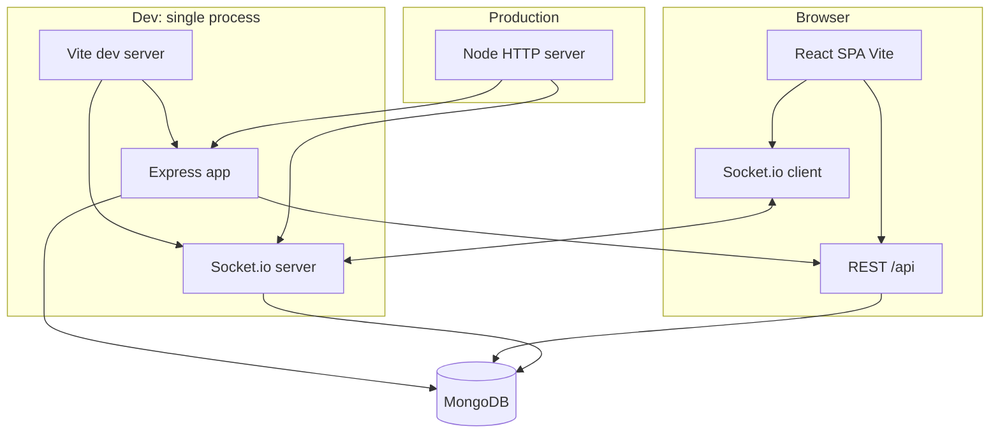
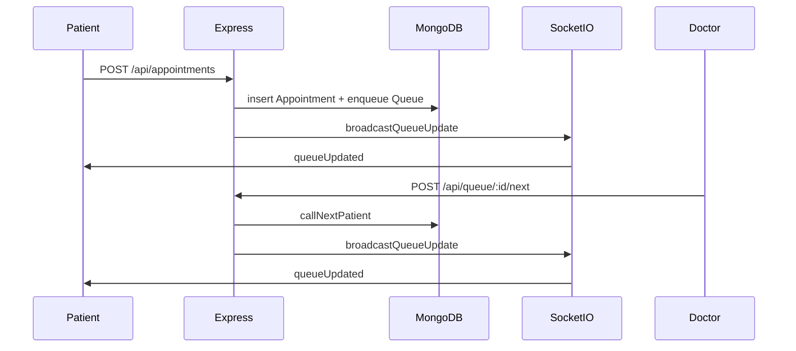

# HealthQueue — Project Architecture

This document describes how the **Cloud-Based Smart Healthcare Queue** codebase is structured: frontend, backend, data layer, and real-time updates.

---

## High-level overview

- **Development:** Vite’s dev server attaches Express as middleware and shares its **HTTP server** with Socket.io so **port 8080** serves both the SPA and `/api` + `/socket.io`.
- **Production:** `server/node-build.ts` creates an `http.Server` from the Express app, attaches Socket.io, serves static files from `dist/spa`, and falls back to `index.html` for client-side routing.

---

## Repository layout

| Path | Role |
|------|------|
| `client/` | React 18 SPA: pages, layouts, `components/ui` (shadcn-style), `components/admin`, hooks, `lib/api.ts`, `lib/socket.ts` |
| `server/` | Express app factory (`index.ts`), HTTP entry (`node-build.ts`), models, routes, services, middleware, `config/db.ts`, `config/socket.ts`, `scripts/seed.ts` |
| `shared/` | TypeScript contracts shared by client and server (`shared/api.ts`) |
| `docs/` | Human-readable guides (this file, startup) |
| `vite.config.ts` | Client build + dev plugin: `connectDb`, `createApp()`, `attachSockets(httpServer)` |
| `vite.config.server.ts` | Bundles `server/node-build.mjs`; heavy deps (`mongoose`, `socket.io`, etc.) are **external** and loaded from `node_modules` at runtime |

Path aliases (see `tsconfig.json` / Vite):

- `@/*` → `client/*`
- `@shared/*` → `shared/*`

---

## Frontend architecture

### Routing (`client/App.tsx`)

| Area | Routes |
|------|--------|
| **Patient** | `/` Auth, `/dashboard`, `/book-appointment`, `/queue` |
| **Staff** | `/admin/dashboard`, `/admin/queue-control`, `/admin/appointments`, `/admin/analytics`, `/admin/settings` |
| **Fallback** | `*` → NotFound |

### Layouts

- **`MainLayout`** — Patient shell (navbar, bottom nav on small screens).
- **`DashboardLayout`** + **`AdminShell`** — Fixed sidebar navigation, sticky top bar, scrollable main; mobile overlay + hamburger.

### Admin UI modules (`client/components/admin/`)

| Component | Purpose |
|-----------|---------|
| `AdminShell.tsx` | Sidebar nav items, active route, logout (clears JWT + socket) |
| `DashboardLayout.tsx` | Composes shell + main content |
| `AppointmentsScreen.tsx` | Staff appointments table; loads/cancels via REST when authenticated |
| `AnalyticsScreen.tsx` | Mock analytics (stats + SVG bar/pie) per product spec |
| `SettingsScreen.tsx` | Tabs + local/mock settings + toast |

### Client HTTP and realtime

- **`client/lib/api.ts`** — `apiFetch`, JWT in `Authorization: Bearer`, `localStorage` keys `hq_token` / `hq_user`.
- **`client/lib/socket.ts`** — Singleton Socket.io client (`path: /socket.io/`), reset on auth change.

### Key user flows (patient)

1. **Auth** — `POST /api/auth/register` | `POST /api/auth/login`; redirect by `role` (patient → dashboard, doctor/admin → admin dashboard).
2. **Book** — `GET /api/doctors`; `POST /api/appointments`; stores `queue_ctx` in `sessionStorage` for the queue page.
3. **Queue tracker** — `GET /api/queue/:doctorId`; emits `joinQueue`; listens for `queueUpdated`.

### Key user flows (staff)

1. **Queue control** — `GET /api/queue/:doctorId`; `POST .../next`, `POST .../absent`; emits `watchQueue`; subscribes to `queueUpdated`.
2. **Appointments** — `GET /api/appointments`; `PATCH /api/appointments/:id/cancel`.

---

## Backend architecture

### Application entry

| File | Responsibility |
|------|----------------|
| `server/index.ts` | `createApp()`: global middleware, mounts `/pi` ping, `/api/auth`, `/doctors`, `/appointments`, `/api/queue`, demo route. `attachSockets(httpServer)` initializes Socket.io once. |
| `server/node-build.ts` | Production: `connectDb()` → `createApp()` → `createServer(app)` → `attachSockets` → static SPA + SPA fallback → `listen(PORT)`. |

### Data models (Mongoose)

| Model | File | Main ideas |
|-------|------|------------|
| **User** | `server/models/User.ts` | `email`, `passwordHash`, `name`, `phone`, `role`: `patient` \| `doctor` \| `admin`; optional `doctorProfile` |
| **Appointment** | `server/models/Appointment.ts` | `patientId`, `doctorId`, `scheduledAt`, unique `token`, `status`: `confirmed` \| `pending` \| `cancelled` |
| **Queue** | `server/models/Queue.ts` | **One document per doctor** (`doctorId` unique); `currentPatientToken`; `waitingList[]` with `patientId`, `token`, `status`: `waiting` \| `called` \| `completed` \| `delayed`, `joinedAt`; `estimatedWaitPerPatient` |

### Services

| Service | File | Role |
|---------|------|------|
| **Auth** | `server/services/auth.service.ts` | bcrypt hashing, JWT sign/verify helpers, user DTO mapping |
| **Queue** | `server/services/queue.service.ts` | Ensure queue doc, enqueue on booking, `callNextPatient`, `markCurrentAbsent`, `buildQueueSnapshot`, remove-from-queue on cancel |
| **Realtime** | `server/services/realtime.service.ts` | Holds Socket.io `Server` ref; `broadcastQueueUpdate(doctorId)` emits to room `doctor:{doctorId}` |

### HTTP routes (Express routers)

| Mount | Router file | Notable endpoints |
|-------|-------------|-------------------|
| `/api/auth` | `routes/auth.routes.ts` | `POST /register`, `POST /login`, `GET /me` |
| `/api/doctors` | `routes/doctors.routes.ts` | `GET /` lists `role: doctor` |
| `/api/appointments` | `routes/appointments.routes.ts` | `POST /` (patient), `GET /` (role-scoped), `PATCH /:id/cancel` |
| `/api/queue` | `routes/queue.routes.ts` | `GET /:doctorId`, `POST /:doctorId/next`, `POST /:doctorId/absent` (doctor/admin) |

### Middleware

- **`server/middleware/auth.ts`** — JWT from `Authorization: Bearer`; attaches `req.authUser` (`id`, `role`); `requireRole(...)`.

### Socket.io (`server/config/socket.ts`)

- Handshake: JWT in `socket.handshake.auth.token` (uses same `JWT_SECRET` as REST).
- **Patient:** `joinQueue` `{ doctorId, token }` — verifies queue entry belongs to socket user; joins `doctor:{doctorId}`.
- **Staff:** `watchQueue` `{ doctorId }` — doctor must match `doctorId`, or user is `admin`; joins same room.
- **Server → client:** `queueUpdated` with payload matching `QueueSnapshot` in `@shared/api`.

Queue-changing routes call `broadcastQueueUpdate` after persisting MongoDB state.

---

## Data and control flow (queue)

---

## Shared contracts

- **`shared/api.ts`** — Cross-cutting types: `UserPublic`, `AuthResponse`, `AppointmentDto`, `QueueSnapshot`, `DoctorListItem`, request/response shapes. Keeps client `fetch` typings aligned with server responses.

---

## Security and operations notes

- Passwords: **bcryptjs**; tokens: **JWT** (short lived configurable via `signToken` options in code).
- Staff self-registration is gated by `ALLOW_STAFF_REGISTER`; production should rely on **seed** or an internal admin process.
- **Secrets** live only in server env — never `VITE_*` for `JWT_SECRET` or `MONGO_URI`.
- **SMS / Google** in the UI are demos only unless you wire external providers.

---

## Related reading

- [startup-guide.md](./startup-guide.md) — install, `.env`, MongoDB, seed, dev/prod commands.
- [AGENTS.md](../AGENTS.md) — Fusion starter conventions (when present in repo).
